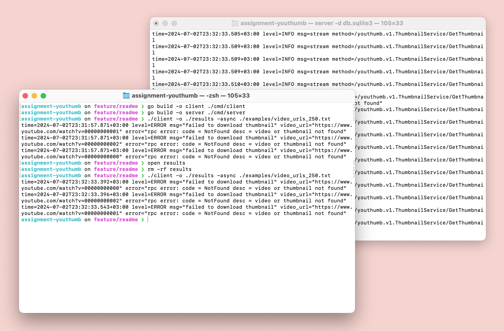

# YouThumb

gRPC сервис для загрузки thumbnail изображений с YouTube.

## gRPC API

Пользователь отправляет запрос на получение thumbnail изображения по URL видео на YouTube. Сервис
возвращает изображение в виде последовательности чанков.

```proto
package youthumb.v1;

service ThumbnailService {
  rpc GetThumbnail(GetThumbnailRequest) returns (stream ThumbnailChunk);
}

message GetThumbnailRequest {
  string video_url = 1;
}

message ThumbnailChunk {
  string content_type = 1;
  bytes data = 2;
}
```

В качестве `video_url` можно использовать и обычную ссылку, и коротую. Например,
ссылки `https://www.youtube.com/watch?v=dQw4w9WgXcQ` и
`https://youtu.be/dQw4w9WgXcQ` эквивалентны. Больше поддерживаемых форматов можно
увидеть в тесте [`internal/thumbnail/url_test.go`](internal/thumbnail/url_test.go).

Полное определение сервиса и документация в файле [`proto/youthumb/v1/youthumb.proto`](proto/youthumb/v1/youthumb.proto).

## Архитектура

Две точки входа:

- [`cmd/server`](cmd/server) - точка входа для запуска gRPC сервера.
- [`cmd/client`](cmd/client) - пример gRPC клиента для отправки запросов на сервер.

Основной пакет с бизнес-логикой:

- [`internal/thumbnail`](internal/thumbnail) - пакет с бизнес-логикой сервиса и
  реализацией gRPC сервера.

Вспомогательныe пакеты для gRPC:

- [`internal/rpc`](internal/rpc) - пакет с основным конструктором gRPC сервера.
- [`internal/rpc/interceptor`](internal/rpc/interceptor) - пакет с middleware для gRPC сервера.
- [`internal/rpc/message`](internal/rpc/message) - пакет с общими сообщениями для gRPC сервера.

Вспомогательныe пакеты для приложения:

- [`internal/app`](internal/app) - пакет с общими компонентами приложения.
- [`internal/app/config`](internal/app/config) - пакет с конфигурацией приложения.
- [`internal/app/log`](internal/app/log) - пакет с логгером приложения.

## Установка и запуск

> *Примечание:* для тестирования в репозитории есть файлы с ссылками на видео.
> Файлы находятся в папке [`examples`](examples). Файлы с 50 и 250 ссылками для
> тестирования содержат ссылки на несуществующие видео, чтобы продемонстрировать
> обработку ошибок.

### Вручную

Запуск сервера с базой данных SQLite для кэша:

```
$ go run ./cmd/server -d db.sqlite3
```

Запуск клиента для загрузки изображений для 50 видео с YouTube асинхронно, результаты сохраняются в папку `./results`:

```sh
$ go run ./cmd/client -async -o ./results ./examples/video_urls_50.txt
```

### Docker Compose

> *Предупреждение:* сборка образов может занять некоторое время.

> *Предупреждение:* внутри контейнеров используется обычный пользователь `user`, поэтому при запуске контейнеров
> необходимо пробросить текущего пользователя в контейнеры, чтобы избежать проблем с правами доступа к файлам.

Сборка и запуск сервера с базой данных SQLite для кэша:

```
$ docker compose up --build
```

Сборка и запуск клиента для загрузки изображений для 50 видео с YouTube асинхронно, результаты сохраняются в папку
`./results`:

```sh
# Данная docker compose run команда:
# - Делает текущую рабочую директорию доступной внутри контейнера Docker (--volume).
# - Заставляет клиента использовать того же пользователя внутри контейнера, чтобы он мог получить доступ к рабочей директории (--user).
# - Помогает клиенту избежать проблем, если *ваш* пользователь не существует внутри контейнера, устанавливая HOME в *доступную для записи* директорию (--env).
$ docker compose run --build \
    --volume "$(pwd):/user/data" \
    --user "$(id -u):$(id -g)" \
    --env HOME=/tmp \
    client -async -o ./results examples/video_urls_50.txt
```

## Демо

[](https://drive.google.com/file/d/18OGnqKGRguiHuV0eoTHgOyJAUHd66tS6/view?usp=sharing)

В [видео](https://drive.google.com/file/d/18OGnqKGRguiHuV0eoTHgOyJAUHd66tS6/view?usp=sharing) показано:

1. Сборка клиента и сервера.
2. Запуск сервера в правом терминале на чистой базе данных.
3. Запуск клиента в левом терминале для загрузки изображений для 250 видео с YouTube в асинхронном режиме. Клиент 
   корректно выводит сообщения о трех не найденных видео с идентификаторами `00000000001`, `00000000002` и
   `00000000003`.
4. Показ содержимого папки `./results` с загруженными изображениями.
5. Удаление папки `./results` и повторный запуск клиента для тех же видео. В этот раз клиент получает изображения
   от сервера из кэша, что видно по заметно быстрому завершению работы клиента.
6. Повторный показ содержимого папки `./results` с загруженными изображениями.
